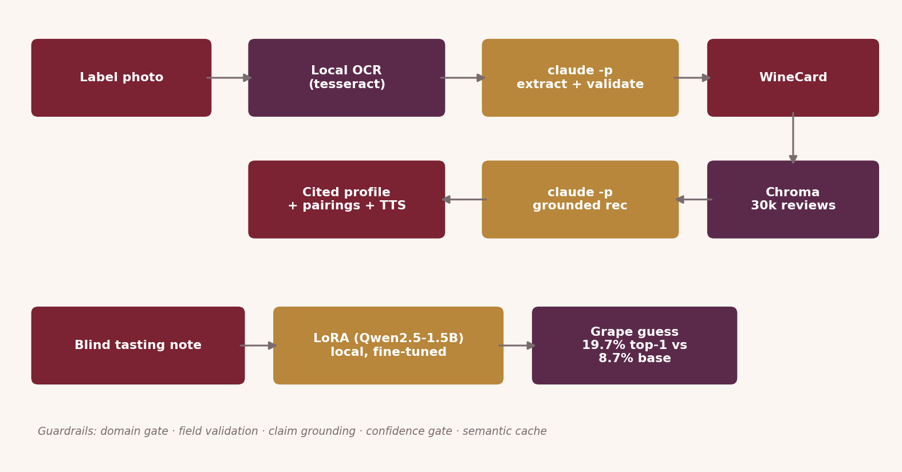

<p align="center">
  
</p>

# Cellar Scanner

Design and copy follow [these standards](https://github.com/lyhjeremy/lyhjeremy/blob/main/DESIGN_STANDARDS.md).

Photograph a wine label: get a grounded profile and food pairings, cited to
real reviews from a 30,000-bottle index, plus a **locally fine-tuned model**
that guesses the grape from a blind tasting note alone.

> **Overview:** https://lyhjeremy.github.io/cellar-scanner/
> **Product overview:** https://lyhjeremy.github.io/cellar-scanner/overview/

## Why

Ask a chatbot to identify or recommend a wine from a label photo and it will
happily invent a producer, a score, a pairing, plausible-sounding and
sometimes just wrong. Cellar Scanner reads the label for real (local OCR +
Claude), retrieves genuinely similar wines from ~30,000 professional reviews,
and grounds every claim in what was actually retrieved, refusing to guess
when the label isn't legible enough to trust.

## How it works

<p align="center">
  
</p>

- **Vision, entirely local.** No Gemini/OpenAI vision key required: `tesseract`
  OCRs the label photo, then `claude -p` (Claude Max subscription, no
  per-token cost) does the domain check and structured extraction in one call
. Refusing non-wine photos and flagging low-confidence reads before any
  retrieval happens.
- **Retrieval.** A 30,000-review index (stratified across all represented
  varieties via water-filling, not just the top-rated bottles), embedded
  locally with `sentence-transformers` + Chroma.
- **Grounded generation.** Every sentence of the profile and every pairing
  reason is checked against the retrieved reviews (`ground_claims`); anything
  that doesn't ground is dropped and regenerated. Citations are real review
  ids, never invented.
- **Blind Taste Mode.** A **Qwen2.5-1.5B model, LoRA fine-tuned locally** on
  ~37k winemag tasting notes (grape names masked out of the training text so
  the task is genuinely blind, not string matching) guesses the variety from
  a tasting note alone, no label, no internet call, runs on this laptop.

## The fine-tune, honestly benchmarked

| System | Top-1 | Top-3 | Macro-F1 | Latency | Cost/1k |
|---|---|---|---|---|---|
| Base Qwen2.5-1.5B (no fine-tune) | 8.7% | 14.3% | 0.021 | 4.3s | $0 |
| **+ LoRA (this project)** | **27.7%** | 27.7% | **0.253** | 10.6s | $0 |
| Claude (teacher, zero-shot) | 23.0% | **30.5%** | 0.119 | 69.6s | Max subscription |

**The fine-tuned local model beats Claude's zero-shot accuracy on Top-1** (27.7% vs
23.0%). A specialized 1.5B model, trained on this exact task, outperforming a
generalist frontier model prompted cold. Claude keeps the edge on Top-3 (30.5% vs
27.7%), for a documented reason: see the known limitation below. Full numbers,
methodology, and the confusion matrix in [`eval/`](eval/) and
[`writeup.md`](writeup.md), generated by
[`training/bench_classifier.py`](training/bench_classifier.py), which subsamples for
tractable iteration and discloses the subsample size rather than hiding it.

**Known limitation, reported not hidden:** the LoRA model's Top-1 and Top-3 are
identical. It never populates ranks 2–3, because its training target was always a
single-line answer, not a full ranked list. It's reproducing its training signal
faithfully; a future retrain with true multi-item targets would close this gap.

Grape names are masked out of every training and reference tasting note before
scoring. Otherwise many reviews simply name the grape ("this Cabernet
shows...") and the task collapses to string matching, not blind tasting. The
masking rate is reported in [`eval/masking_report.json`](eval/masking_report.json).

## Guardrails

- **Domain gate.** A non-wine photo gets a friendly refusal, not a
  hallucinated card.
- **Field validation.** Vintage range-checked, grape validated against the
  winemag vocabulary.
- **Claim grounding.** Every recommendation sentence must match a retrieved
  review; ungrounded claims are dropped and regenerated.
- **Confidence gate.** A low-confidence label read asks for a retake instead
  of guessing.
- **Semantic cache.** Re-scanning the same bottle is an instant, free cache
  hit (measured hit-rate in the dev panel).

## Files

| File | Purpose |
|---|---|
| `app.py` | Gradio app (Scan + Blind Taste Mode) |
| `scripts/ingest.py` | Builds the 30k-review stratified index |
| `training/prep_classifier.py` | Masked, leakage-checked classifier dataset |
| `training/bench_classifier.py` | 3-way honest benchmark (base/LoRA/Claude) |
| `src/` | Vendored toolkit (llm, vision, guardrails, context, cache) + `scanner.py` |
| `eval/` | Benchmark results, confusion matrix, dataset card |

## Running it

```bash
pip install -r requirements.txt
./setup_ocr.sh                      # tesseract + language packs (one-time)
python scripts/ingest.py            # builds the wine review index
python training/prep_classifier.py  # builds the masked classifier dataset
bash training/lora_harness/train.sh mlx-community/Qwen2.5-1.5B-Instruct-4bit \
    data/lora training/adapters 4 12 800 1.5e-4 768
python app.py
```

No API key required, everything runs locally except a `claude -p` call for
generation (uses your Claude subscription, not a metered API).

## License

MIT, see [`LICENSE`](LICENSE).
