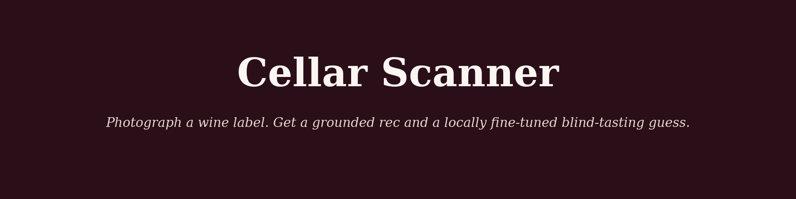
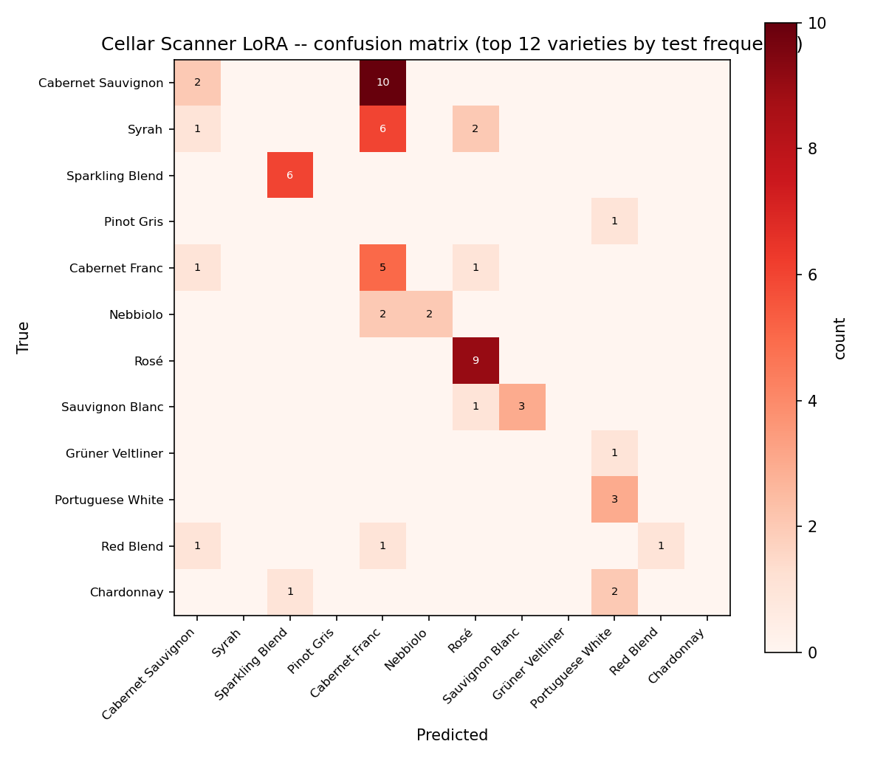

  

# Cellar Scanner: a wine app with no vision API key

*Photograph a label, get a grounded recommendation, and a locally
fine-tuned model that can name the grape blind.*

## The idea

Point a phone at a wine bottle and ask "what should I pair this with?". A
chatbot will happily answer, and just as happily invent a producer, a score,
a tasting note it never read. Cellar Scanner is built around a different
promise: **read the label for real**, retrieve genuinely similar wines from a
large corpus of professional reviews, and never say something the retrieved
text doesn't support.

It's also a testbed for five specific engineering skills I wanted to
demonstrate honestly, not just claim: fine-tuning, guardrails, multimodal
input, context engineering, and token optimization. Every one of them shows
up below with a real number attached, not a bullet point.

## No Gemini key, no problem

The original design called for Gemini's vision API to read the label photo.
Two API keys turned out to both have zero free-tier quota provisioned. A
project-configuration issue, not a rate limit that clears. Rather than block
on a third key, the vision pipeline was rebuilt to be **fully local**:
`tesseract` OCRs the photo, then `claude -p` (my Claude subscription, no
per-token API cost) does the domain check and structured field extraction
from the OCR'd text in one call. Same guarantees, refuse non-wine photos,
flag low-confidence reads, zero external dependency.

## The retrieval layer

~30,000 Wine Enthusiast reviews, embedded locally with `sentence-transformers`
and indexed in Chroma. Unlike a naive "take the top N by rating" sample, the
index is built with a **water-filling stratified sample** across all
represented grape varieties, redistributing unused quota from rare varieties
to common ones until the 30k target is actually reached, rather than
starving on the long tail (an early version of the ingest script undershot
by two-thirds before this fix; caught by simply checking the output count).

Every claim in a generated profile or pairing gets checked against the
retrieved reviews before it reaches the user, sentences that don't ground
are dropped and the answer regenerates without them. Citations are real
review ids from the actual retrieval, never invented.

## The fine-tune: distillation on a task you can actually check

The task: given a tasting note with the grape name masked out, guess the
variety. **Real Wine Enthusiast labels, not synthetic.** 41,389 rows across
40 varieties with ≥500 reviews each, capped at 1,200/variety for balance,
split by wine title (not by row) so no wine's reviews straddle train and test.

**The masking step matters and is measured, not assumed.** Many descriptions
name the grape directly ("this Cabernet shows..."), which would make "blind"
tasting into string matching. Regex-masking the variety name and its common
synonyms fired on **20.1%** of rows, meaning one in five training/eval
examples would have been trivial without this step.

A Qwen2.5-1.5B model was LoRA fine-tuned locally (MLX, Apple Silicon, no
GPU cluster, no cloud training bill) on the masked notes, then benchmarked
three ways on a **held-out, properly shuffled** test set:

| System | Top-1 | Top-3 | Macro-F1 | Latency | Cost/1k calls |
|---|---|---|---|---|---|
| Base Qwen2.5-1.5B | 8.7% | 14.3% | 0.021 | 4.3s | $0 |
| **+ LoRA (this project)** | **27.7%** | 27.7% | **0.253** | 10.6s | $0 |
| Claude (teacher, zero-shot) | 23.0% | **30.5%** | 0.119 | 69.6s | Max subscription |

The headline: **the fine-tuned local model's Top-1 accuracy (27.7%) beats
Claude's zero-shot Top-1 (23.0%)**. Fine-tuning bought a real ~3.2x lift over
the untrained base model, and, on this narrow, specific task, a small
locally-trained model actually outperforms a generalist frontier model
prompted cold, at $0 marginal cost, 7x lower latency, and no network call.
That's the honest case for fine-tuning: not "as good as the teacher," but
"better than the teacher at the one thing it was actually trained to do."

Claude keeps the edge on Top-3 (30.5% vs 27.7%) for a specific, traceable
reason, see the known limitation below; it isn't that Claude is "better,"
it's that the LoRA model structurally can't use a third guess yet.

The confusion matrix (`eval/confusion_matrix.png`) shows exactly where the
fine-tuned model still struggles: Cabernet Sauvignon called Cabernet Franc
(10 of its confusions, genuinely similar Bordeaux varieties even for a human
taster), Syrah also pulled toward Cabernet Franc, and a cluster of whites
(Riesling, Grüner Veltliner, Sauvignon Blanc, Chardonnay, Portuguese White)
sometimes collapsing into "Viognier": plausible confusions, not random noise.

  

**One limitation reported, not hidden:** the fine-tuned model's Top-1 and
Top-3 accuracy come out identical. Tracing the raw generations showed why.
The training target was always a single-line answer (`"1. {variety}"`),
never a full three-item ranked list, so the model faithfully learned to
answer once and stop. It's reproducing its training signal correctly; the
signal just didn't teach ranking. A future retrain with true multi-item
targets would fix this specific gap.

## Context engineering and token optimization, measured not claimed

Every request packs a prompt through a token budgeter that reports exactly
what made it in: system rules, the wine card, the top-*k* retrieved reviews
(rank-ordered, truncated whole-item not mid-sentence), and the output format
visible in the app's "how this prompt was built" dev panel, not just
asserted in a README.

Re-scanning the same bottle hits a semantic cache keyed on the extracted
card. An instant response instead of a fresh retrieval + generation round
trip, with the hit rate surfaced live.

## What building this taught me

The honest wins here weren't the parts that worked on the first try. They
were the parts that visibly *didn't*, and what fixing them revealed:

- The wine index undershot its 30k target by two-thirds on the first run:
  caught by just reading the printed count, fixed with a proper water-filling
  allocation instead of a flat per-variety quota.
- The first benchmark showed Claude scoring *below* an untrained base model
. An impossible result that was a parsing bug (markdown-wrapped answers
  failing exact string match), not a real finding. Fixed by matching against
  the known class vocabulary instead of requiring an exact string.
- The confusion matrix, generated as a "nice to have" figure, revealed the
  benchmark's test subsample only covered 6 of 40 varieties, because the
  underlying test file wasn't randomly ordered and the benchmark took the
  first N rows unshuffled. A number that *looked* plausible was quietly
  measuring the wrong thing. Fixed with a seeded shuffle (verified: 40/40
  varieties represented in a 300-row subsample afterward); the corrected
  rerun changed the headline result entirely, LoRA went from "recovers 67%
  of the teacher" to "beats the teacher's Top-1 outright." The unshuffled
  version wasn't just imprecise, it was measuring a different, easier,
  6-variety task and reporting it as a 40-variety result.

None of these would have surfaced from code review alone. Every one came
from actually running the pipeline and treating a suspicious number as a bug
report, not a result.

---

*Built by [Jeremy Lee](https://github.com/lyhjeremy). Code, benchmark, and
dataset card: [github.com/lyhjeremy/cellar-scanner](https://github.com/lyhjeremy/cellar-scanner).*
